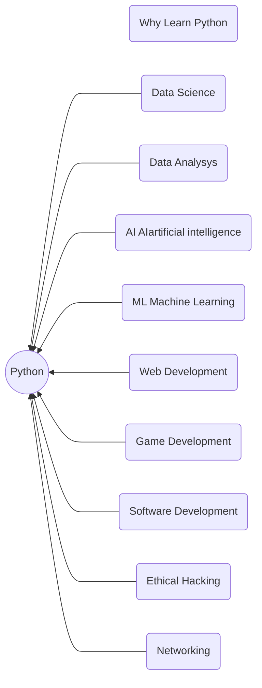

## About Python

#### What is Python
Python is an interpreted, high-level and general purpose programming language
that focuses on readability and simplicity. It was created in the late 1980s by Guido van Rossum also known as 'Benevolent Dictator for that focuses on readability and simplicity. It that focuses on readability and simplicity. It that focuses on readability and simplicity.

Interpeter: The code written in python is executed line  by line. 

##### Types of programming  languages
 1. **Compiled Language** : C , Java , Go
    - Code is converted into machine language before execution . It has a separate memory space for data and instructions . They convert the source code into machine code which
    - Code is converted into machine code before execution .
 1. **Interpreted**  : Python , Ruby , Perl
     - Code is read and then executed line by line .
     
 #### Advantages of Python over other languages
 1. Readability : It has simple
 syntax which makes it easy to understand for beginners .
  
 1. Versatility : Python can be used for web development (Django) , data analysis(Pandas), Machine Learning (TensorFlow) etc.

#### Why Learn Python?
 1. Python is most used in  data science field .
 1. With the rise of AI and Machine Learning (ML) , Python is becoming more popular with developers due to its simplicity and ease 
 1. It is very easy to learn

#### How Learn  Python ?
 1. Install Python
 1. IDE Setup
 1. jupyter notebook
 1. Google Colab
 1. Start with Basics