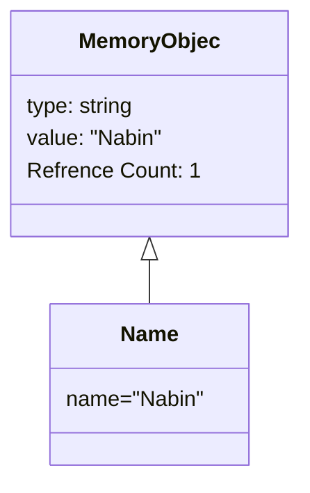
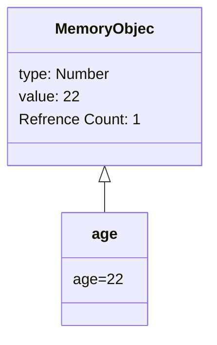
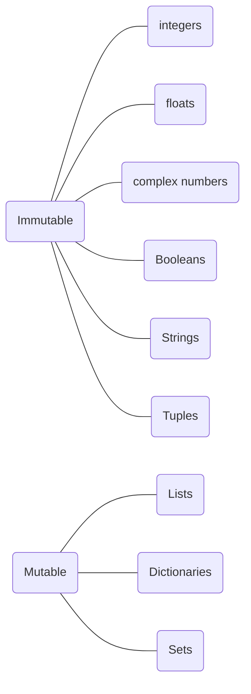

### Variables in Python
// https://docs.python-guide.org

name="Nabin" # Assigning value to a variable

in the memory



like wise when we store:
age=22



#### Mutable and immutable variables in Python


#### Keywords in Python

<pre>
    False               class               from                or
    None                continue            global              pass
    True                def                 if                  raise
    and                 del                 import              return
    as                  elif                in                  try
    assert              else                is                  while
    async               except              lambda              with
    await               finally             nonlocal            yield
    break               for                 not
</pre>

#### Comments in Python
``` python
# This is a comment. It will be ignored by the interpreter.
"""This is also a comment, but it's a docstring, which provides documentation to other programmers reading your code."""

```

#### Input Output
``` python
# To get input from user:
name = input("Enter your name: ")
print("Hello, " + name)
```